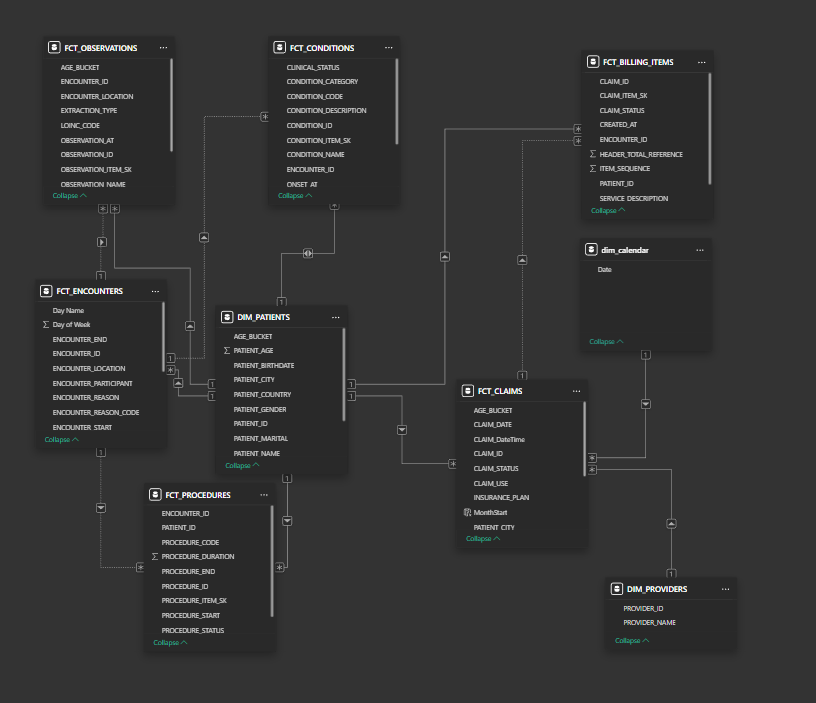
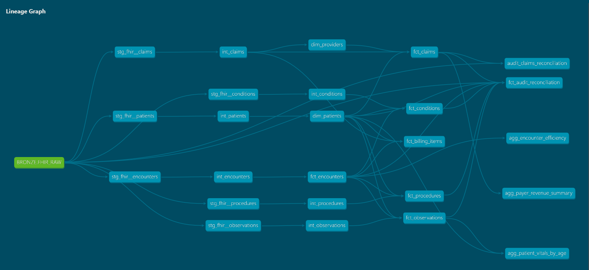
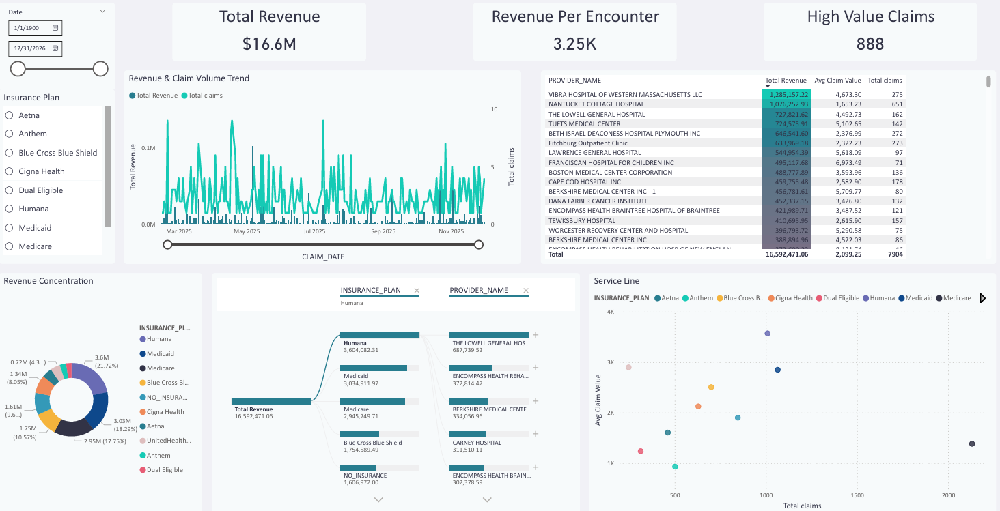
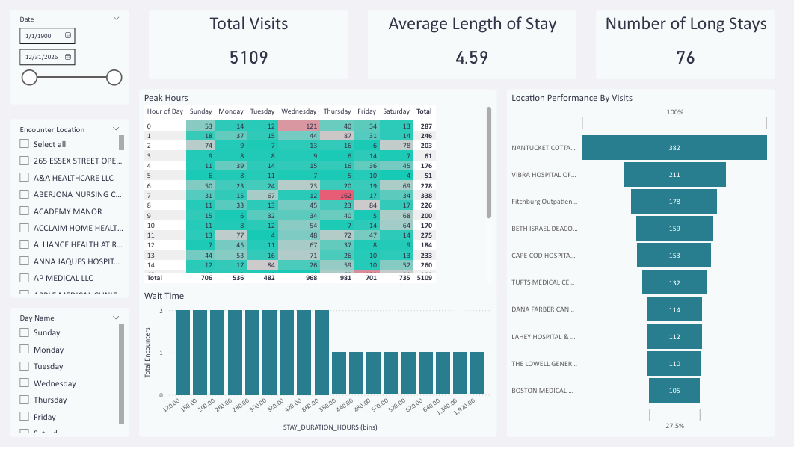
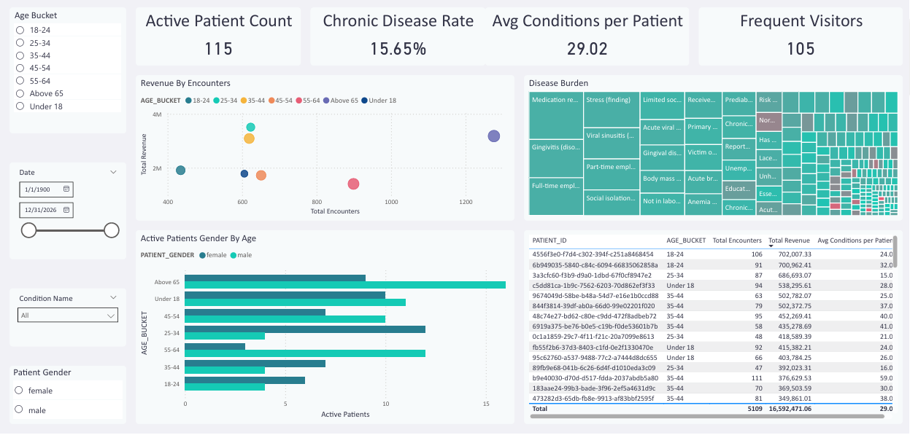

#  End-to-End Healthcare Data Platform: FHIR to Dashboard

### **Overview**
A scalable, modern data engineering platform that ingests, processes, and visualizes synthetic healthcare data (FHIR) to drive clinical and operational insights. This project simulates a real-world hospital environment, handling complex nested JSON data through a **Medallion Architecture** (Bronze/Silver/Gold) to power an executive-level Power BI dashboard.

The system is designed to handle the "Vs" of Big Data (Volume and Variety) by decoupling ingestion from processing using Kafka and Snowflake.



---

### Architecture & Tech Stack
This pipeline is designed for scalability and idempotency, ensuring that data can be re-processed without duplication or loss.

| Component | Technology | Role in Pipeline |
| :--- | :--- | :--- |
| **Source System** | **Synthea / Python API** | Generates high-volume synthetic FHIR (JSON) patient data. |
| **Streaming** | **Redpanda (Kafka)** | Acts as the decoupled buffer between generation and ingestion to handle backpressure. |
| **Ingestion** | **Python Consumer** | Consumes messages and loads raw JSON into **Snowflake (Internal Stage)**. |
| **Warehousing** | **Snowflake** | Serves as the central Data Warehouse with separated compute/storage. |
| **Transformation** | **dbt (Data Build Tool)** | Transforms raw JSON into structured tables using **Medallion Architecture**. |
| **Orchestration** | **Apache Airflow** | Schedules and monitors the entire pipeline (Ingestion -> dbt Test -> dbt Run). |
| **Visualization** | **Power BI** | 3 specialized views: Financial (CFO), Operational (COO), and Clinical (CMO). |

---

### **Data Flow & Modeling (The Medallion Architecture)**
I implemented a multi-layer transformation strategy to ensure data quality and governance.

#### **1. Bronze Layer (Raw Ingestion)**
* **Goal:** Ingest raw FHIR JSON bundles "as-is" to maintain a perfect historical record.
* **Challenge:** FHIR data is deeply nested (e.g., `entry[0].resource.name[0].given[0]`).
* **Solution:** Loaded as `VARIANT` type in Snowflake for flexible Schema-on-Read.

#### **2. Silver Layer (Cleaned & Flattened)**
* **Goal:** Deduplicate, flatten, and type-cast data for analysis.
* **Key Transformations:**
    * **Flattening:** Unpacked nested JSON arrays into relational rows using Snowflake's `LATERAL FLATTEN` functions.
    * **Deduplication:** Implemented `QUALIFY ROW_NUMBER()` logic to handle duplicate messages from the Kafka stream, ensuring exactly-once processing.
    * **Casting:** Converted ISO8601 strings to native `DATE` and `TIMESTAMP` types.

#### **3. Gold Layer (Business Aggregates)**
* **Goal:** Pre-computed metrics for the dashboard (Star Schema).
* **Models:**
    * `dim_patients`: patient demographics (current address, race, age).
    * `fct_encounters`: Transactional fact table for hospital visits.
    * `fct_claims`: Financial ledger linking costs to clinical outcomes.



---

### Challenges & Trade-offs
*Every project has hurdles. Here is how I solved the biggest ones:*

**1. Handling Synthetic Data**
* **Problem:** Synthea generates 100% "Active" claims, which made financial analysis look unrealistic (0% denial rate).
* **Solution:** I engineered "Derived Metrics" in the Gold layer, such as **Revenue Per Patient** and **Comorbidity Indexes**, to focus on *utilization intensity* rather than simple claim status. This allows the dashboard to drive value even with synthetic constraints.

**2. The Many-to-Many Trap (Conditions vs. Claims)**
* Problem Patients have multiple conditions and multiple claims, but they don't link directly. Filtering by "Diabetes" caused revenue numbers to go blank or duplicate in the BI tool.
* Solution: Resolved a many-to-many fan-out problem between clinical conditions and financial claims by pre-computing disease-cohort metrics as dedicated Gold-layer aggregation models in dbt (AGG_ENCOUNTER_EFFICIENCY, AGG_PATIENT_VITALS_BY_AGE, AGG_PAYER_REVENUE_SUMMARY), avoiding Cartesian joins at query time.

**3. Orchestration Reliability**
* I chose Airflow over simple cron jobs to enable backfilling and alerting. If the dbt test suite fails (e.g., `unique_id` check on `dim_patients`), the pipeline halts preventing bad data from reaching the CFO's dashboard.

---

### **The Dashboard**

#### Page 1: Financial Performance
* **Focus:** Revenue Cycle Management & Payer Mix.
* **Key Metric:** Revenue and Payer Concentration.
* **Insight:** Allows to identify if the hospital is over-reliant on a single insurance payer (e.g., Medicare).



#### **Page 2: Operations & Efficiency**
* **Focus:** Throughput & Bottlenecks.
* **Key Metric:** Average Length of Stay (LOS) vs. Wait Times.
* **Visual:** Hourly Heatmap of ER visits to optimize staffing schedules (Peak Hour Detection).



#### **Page 3: Population Health**
* **Focus:** Clinical Risk Stratification.
* **Key Metric:** Chronic Disease Rate & Comorbidity Index.
* **Visual:** Risk Scatter Plot (Cost vs. Complexity) identifying "Frequent Flyers" patients who are high-cost and high-frequency.



---

### **How to Run This Project**

**Prerequisites:**
* Docker & Docker Compose
* Python 3.9+
* Snowflake Account
* Power BI Desktop

**1. Start the Infrastructure**
```
docker-compose up -d
```
**2. Run the Producer (Simulate Hospital Data)**
This script generates random FHIR bundles and pushes them to the Redpanda topic.
```
python scripts/produce_json.py --rate 10 --duration 600
```
**3. Run the Consumer **
```
python scripts/consumer_json.py
```
**4. Run the Snowflake setup script (first run only)**
```
python scripts/setup_snowflake.py
```
**4. Trigger the Airflow DAG**

-   Navigate to `localhost:9091`.
    
-   Trigger `ingestor`.
   


### **Contact**

-   **Name:** Karim Baraka
    
-   **Role:** Data Engineer
    
-   **LinkedIn:** https://www.linkedin.com/in/karim-yasser-372874319/
    
-   **Email:** kishibe101@gmail.com
